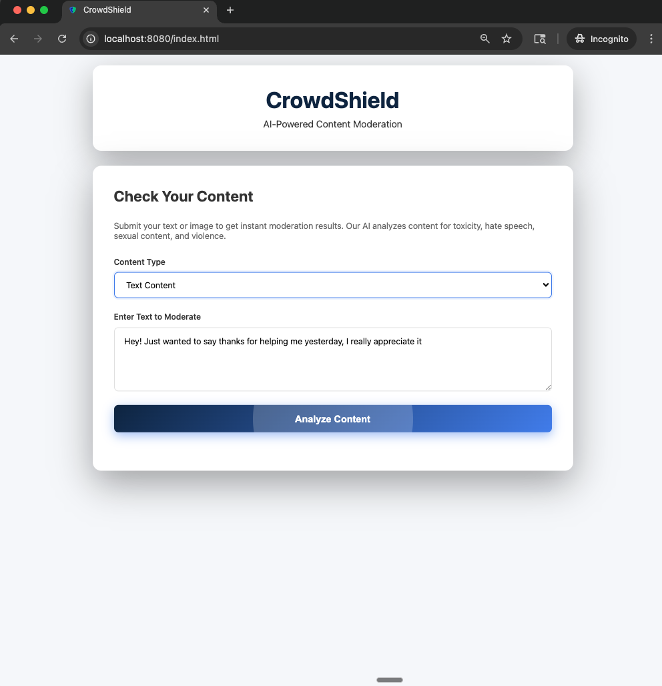
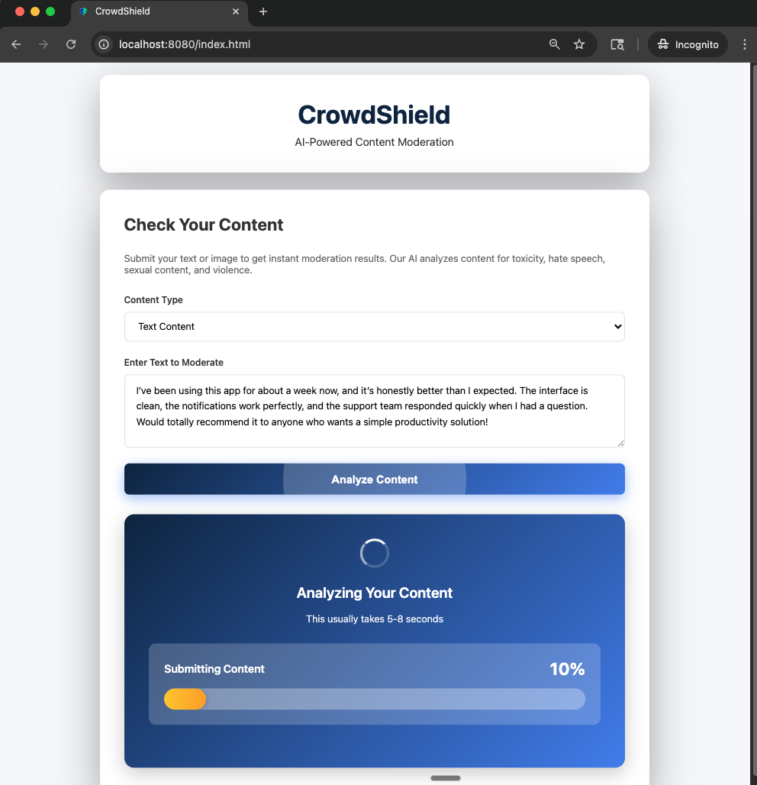
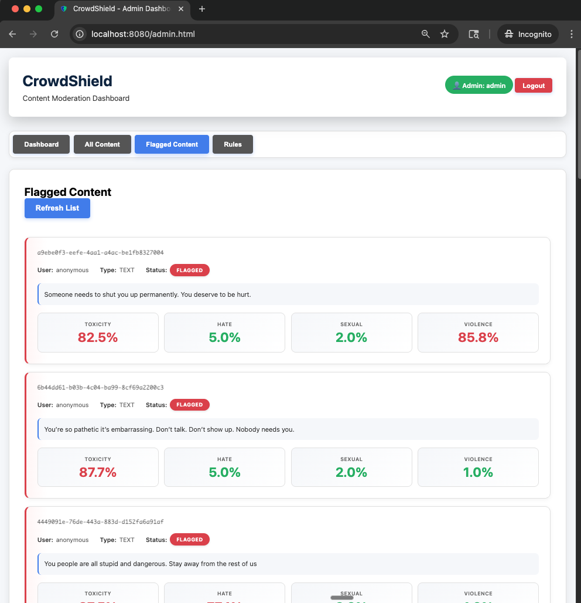
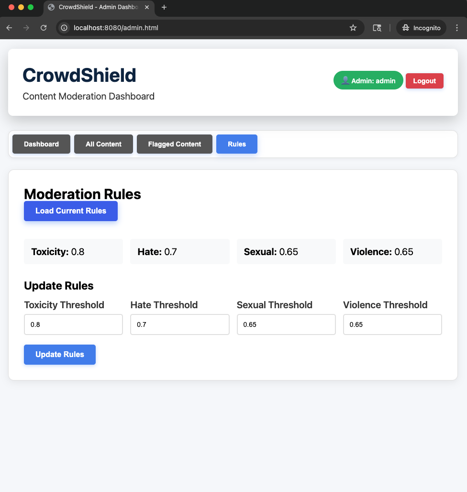

# CrowdShield, A Real-Time Content Moderation Platform

 <p align="center">
  
</p>

Every platform today, whether it’s a chat app, marketplace, gaming platform, or social media site, faces the same growing problem:

Users generate content faster than humans can review it.

And when harmful content slips through,
like toxic messages, hate speech, or violent threats,
it hurts user trust, community health, and brand reputation.

Most platforms try manual moderation… and quickly discover:

* It’s too slow
* It’s too expensive
* It doesn’t scale
* It can’t keep up with real-time user activity.

So I asked myself,

How can I build a moderation engine that works instantly, accurately, and reliably, without slowing users down?
That’s where CrowdShield comes in.

---

## Table of Contents

- [About CrowdShield](#about-crowdshield)
- [Tech Stack](#tech-stack)
- [Setup Environment](#setup-environment)
- [How to Run](#how-to-run)
- [Screenshots](#screenshots)
- [Result](#result)
  
---

## About CrowdShield

CrowdShield automatically checks every piece of user-submitted content like comments, messages, or reviews, and decides whether it’s SAFE or FLAGGED.

### 🔄 How It Works

1. **User submits content**
2. **Content enters a Redis-powered moderation queue**
3. **A background worker processes it using ML models (OpenAI)**
4. **ML scores (toxicity, hate, violence, sexual content) are evaluated**
5. **UI displays the result in real time**

**No blocking. No manual delays. No degraded user experience.**

Admins get a separate dashboard to:

* review flagged content
* update moderation thresholds
* override decisions
* maintain platform safety

CrowdShield uses engineering patterns found in real production systems at Meta, Reddit, YouTube, Twitch, including:

* queue-based asynchronous moderation
* ML-powered classification
* worker-driven job processing
* dynamic moderation rules
* fault-tolerant retry mechanisms

---

## Tech Stack

| Category | Technology |
|----------|-----------|
| **Backend** | Java 17, Spring Boot 3.2.0 |
| **Queue System** | Redis 6+ |
| **Worker** | Spring Scheduled Worker |
| **ML API** | OpenAI Moderation API |
| **Database** | PostgreSQL 12+ |
| **Frontend** | HTML, CSS, JavaScript |
| **Build Tool** | Maven 3.6+ |
| **Authentication** | JWT (JSON Web Tokens) |
| **Real-Time** | WebSocket (STOMP over SockJS) |

---

## Setup Environment

### Prerequisites

- **Java 17+** installed
- **Maven 3.6+** installed
- **PostgreSQL 12+** installed and running
- **Redis 6+** installed and running
- **OpenAI API Key** (optional - system falls back to mock if not provided)

### Step 1: Clone the Repository

```bash
git clone https://github.com/yourusername/CrowdShield2.git
cd CrowdShield2
```

### Step 2: Install Dependencies

#### macOS
```bash
# Install Java 17
brew install openjdk@17

# Install Maven
brew install maven

# Install PostgreSQL
brew install postgresql@14
brew services start postgresql@14

# Install Redis
brew install redis
brew services start redis
```

### Step 3: Setup Database

```bash
# Connect to PostgreSQL
psql -U postgres

# Create database
CREATE DATABASE crowdshield;

# Exit
\q
```

### Step 4: Configure Environment Variables

Create a `.env` file in the project root:

```bash
# Database Configuration
DB_USERNAME=your_postgres_username
DB_PASSWORD=your_postgres_password

# Redis Configuration
REDIS_HOST=localhost
REDIS_PORT=6379

# ML API Configuration
ML_PROVIDER=openai
OPENAI_API_KEY=your-openai-api-key-here

# Admin Credentials (optional)
ADMIN_USERNAME=admin
ADMIN_PASSWORD=admin123
```

**Get OpenAI API Key:**
1. Visit: https://platform.openai.com/api-keys
2. Sign up or log in
3. Create a new API key
4. Copy the key (starts with `sk-`)

---

## How to Run

### Step 1: Start Redis

```bash
# macOS/Linux
redis-server

# Or if using brew services (macOS)
brew services start redis
```

### Step 2: Build the Project

```bash
mvn clean install
```

### Step 3: Run the Application

```bash
mvn spring-boot:run
```

The application will start on `http://localhost:8080`

### Step 4: Access the Application

- **User Interface**: Open `http://localhost:8080/` in your browser
- **Admin Dashboard**: Open `http://localhost:8080/admin` in your browser

### Verify Installation

```bash
# Check health endpoint
curl http://localhost:8080/actuator/health

# Expected response: {"status":"UP"}
```

---

## Screenshots

### User Content Submission



*Main interface where users submit text or image content for moderation. The form includes content type selection and real-time progress tracking.*

### User Status Display



*Real-time status display showing moderation progress with an animated progress bar. Results display moderation scores and SAFE/FLAGGED label.*

### Admin Flagged Content



*Admin dashboard showing all flagged content for review. Administrators can see moderation scores and manually override decisions.*

### Admin Rules Management



*Rules management interface where administrators can update moderation thresholds for toxicity, hate speech, sexual content, and violence.*

---

## Result

CrowdShield provides a **production-ready moderation engine** that:

-  **Processes content reliably** through an asynchronous queue system
-  **Makes real-time decisions** using ML APIs with configurable thresholds
-  **Provides a simple REST API** that other applications can integrate
-  **Displays clear results** with SAFE/FLAGGED labels and detailed scores
-  **Offers an intuitive UI** for both users and administrators
-  **Handles errors gracefully** with automatic retries and fallback mechanisms

The system is ready to handle real-world content moderation needs and can be easily integrated into existing applications.

---
